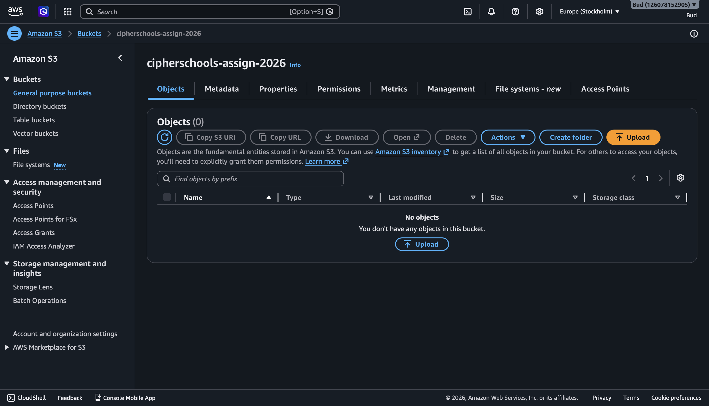
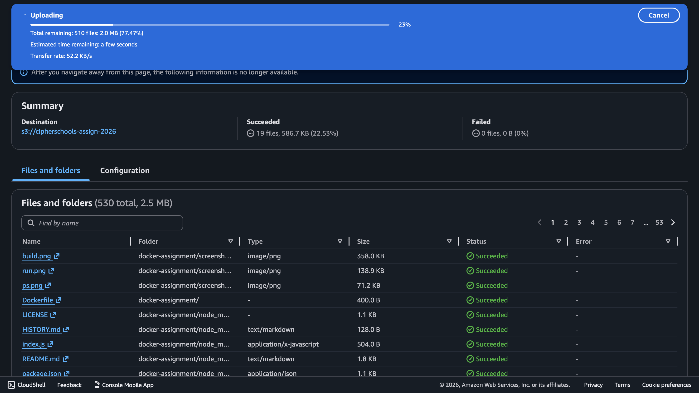
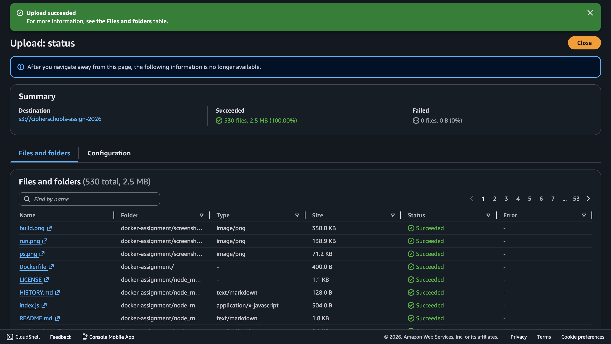
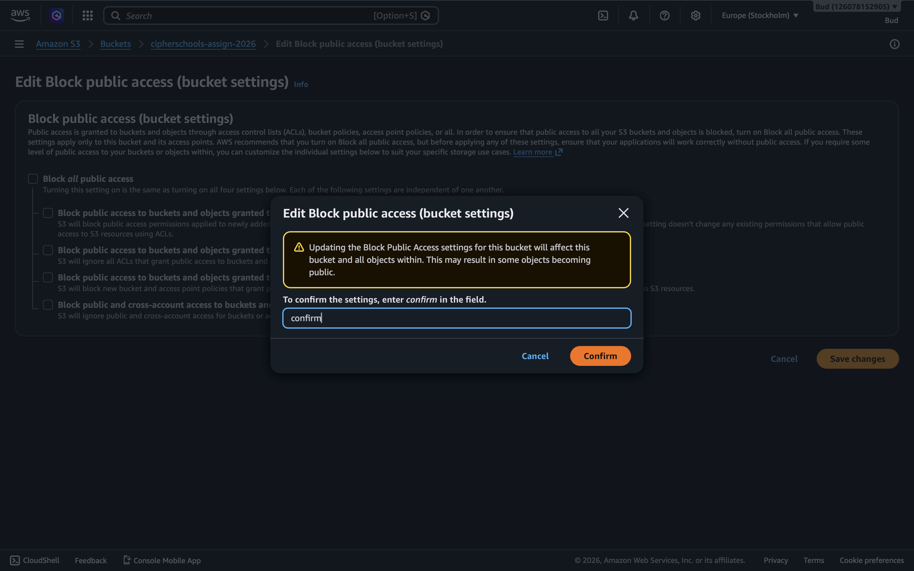
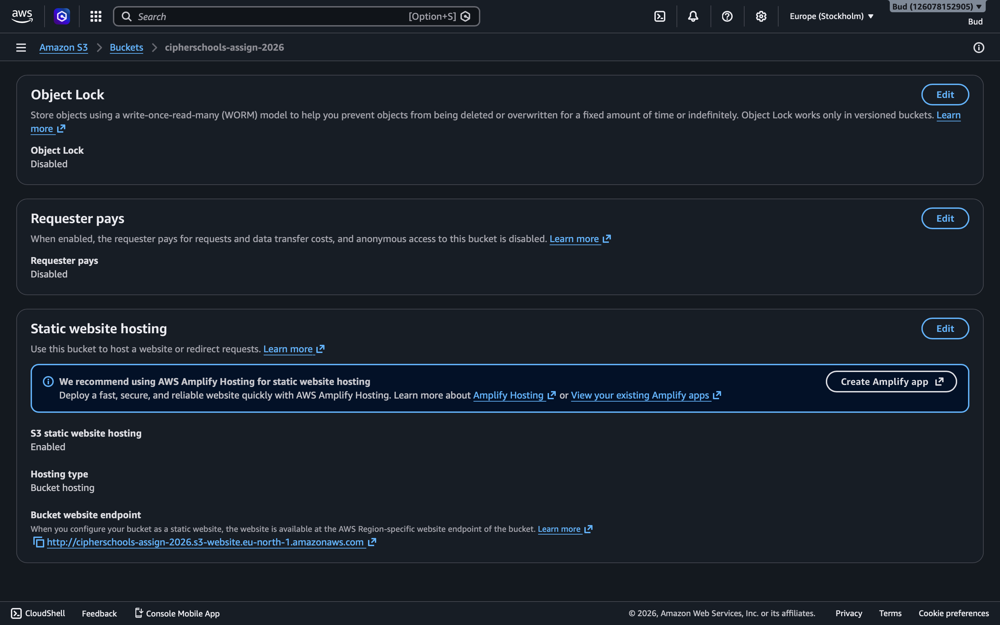

# Docker Containerization Assignment

## 1. Docker Image Build

## 2. Running Container

## 3. Docker PS Output

# Deployment Process & Proof
## 1. Amazon S3 Bucket Creation

## 2. Source Code Upload

## 3. Static Website Hosting Configuration

## 4. Live Website Verification

http://cipherschools-assign-2026.s3-website.eu-north-1.amazonaws.com